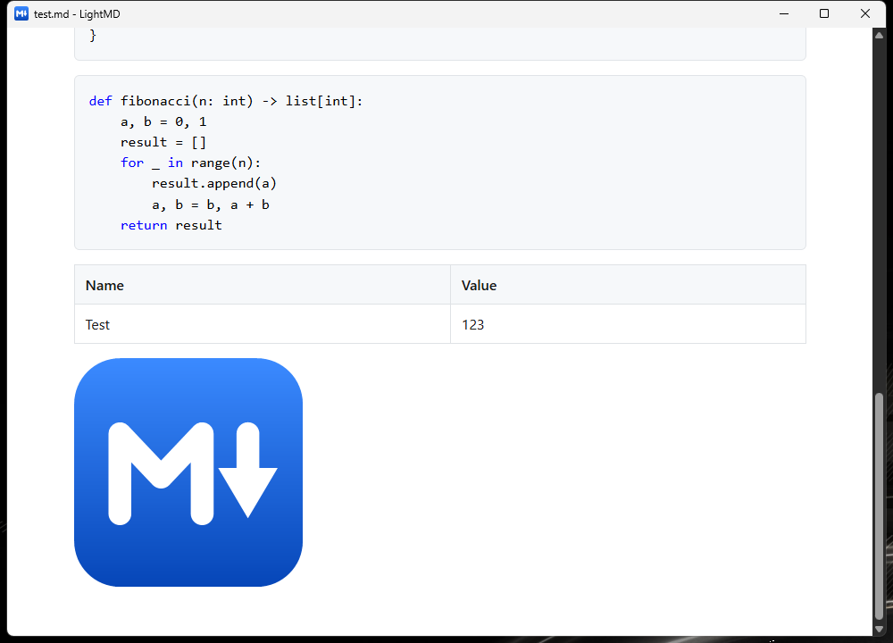

# LightMD

**A lightweight Markdown viewer for Windows.**
Double-click a `.md` file, it opens instantly in preview mode, no editor.

<br clear="left">



---

## Overview

Markdown files are written to be read, but Windows opens them in Notepad — as raw
text, with the `#` and `|` and `**` still showing. LightMD renders them the way
they were meant to look: headings, tables, code blocks, links.

It is deliberately small. LightMD is a **viewer**, not an editor and not a
notes app:

- **It opens a file and displays it.** No tabs, no sidebar, no library.
- **It stays out of the way.** No settings to configure, nothing to sign into.
- **It's about 2 MB.** It opens instantly.

| | |
|---|---|
| **What it does** | Renders Markdown — headings, **bold**, *italic*, tables, syntax-highlighted code, blockquotes, lists, images, task lists, footnotes. Follows your light/dark theme, reloads on save, and follows links between documents |
| **What it doesn't** | Edit, save, export, print, or sync anything |
| **Reads** | `.md`, `.markdown`, `.mdown`, `.mkd`, `.mkdn`, `.mdwn`, `.mdtxt`, `.text` |
| **Needs** | Windows 10/11, and the [.NET 8 Desktop Runtime](https://dotnet.microsoft.com/download/dotnet/8.0/runtime) |

---

# For users

## Installing

Run **`LightMD-1.0.0.0-x64.msi`** and follow the prompts. It installs to
`C:\Program Files\LightMD` and adds a LightMD entry to your Start menu.

If Windows shows a blue "Windows protected your PC" box, that's SmartScreen
reacting to an installer that hasn't been code-signed — click **More info** →
**Run anyway**. (Signing requires a paid certificate.)

> **One prerequisite:** LightMD needs the free
> [.NET 8 Desktop Runtime](https://dotnet.microsoft.com/download/dotnet/8.0/runtime).
> If it's missing, the app will tell you and link you straight to the download.

## Opening a file

Any of these work:

- **Drag and drop** a Markdown file onto the LightMD window.
- **Right-click** a `.md` file → **Open with** → **LightMD**.
- **From a terminal:** `LightMD.exe "C:\path\to\notes.md"`

### Making LightMD the default for `.md` files

The installer deliberately *doesn't* hijack your existing `.md` association — if
you already use VS Code or Obsidian for Markdown, it leaves that alone. To make
LightMD the default yourself:

1. Right-click any `.md` file → **Open with** → **Choose another app**
2. Pick **LightMD**
3. Tick **Always use this app to open .md files**

## Using it

There isn't much to learn — it's a reader.

| Action | What happens |
|---|---|
| Scroll / arrow keys / Page Up-Down | Move through the document |
| Click a link to a heading | Jumps to that section |
| Click a link to another Markdown file | Opens it here, at the right heading if the link names one |
| Click a link to any other local file | Opens in whichever app owns that file type |
| Click a web link | Asks first, then opens in your normal browser, not inside LightMD |
| Drop a new file on the window | Replaces what's shown |
| Save the file you're reading | The window updates on its own, keeping your place |
| Switch Windows between light and dark | LightMD follows immediately |

## Uninstalling

**Settings** → **Apps** → **Installed apps** → **LightMD** → **Uninstall**.

LightMD keeps a small cache in `%LOCALAPPDATA%\LightMD`, which you can delete
by hand afterwards if you want it gone completely.

## If something goes wrong

| Problem | Fix |
|---|---|
| "You must install .NET" on launch | Install the [.NET 8 Desktop Runtime](https://dotnet.microsoft.com/download/dotnet/8.0/runtime) |
| "Failed to initialize the viewer" | Install the [WebView2 Runtime](https://developer.microsoft.com/microsoft-edge/webview2/) — it ships with Windows 11, so this is rare |
| "Unsupported file type" | The file's extension isn't in the supported list above. Rename it to `.md` |
| Window opens blank | Delete `%LOCALAPPDATA%\LightMD` and reopen |

---

# For developers

## How it works

LightMD is three small pieces:

```
 file.md ──▶ Markdig ──▶ HTML + inline CSS ──▶ WebView2 ──▶ window
```

1. **[`Program.cs`](LightMD/Program.cs)** — entry point. Passes command-line
   args to the form; `args[0]` is the file to open.
2. **[`MarkdownRenderer.cs`](LightMD/MarkdownRenderer.cs)** — converts Markdown
   to a complete HTML document with the stylesheet inlined in a `<style>` block.
   No external files, no temp files, no web server.
3. **[`Form1.cs`](LightMD/Form1.cs)** — the window. Hosts a WebView2 control,
   handles drag-and-drop, and intercepts navigation so external links open in
   the system browser instead of inside the app.

The rendered HTML is handed to WebView2 via `NavigateToString`, so a document
never touches disk.

### Local images

Documents are shown with `NavigateToString`, which gives the page a `data:` URI.
There's no base path for a relative `src` to resolve against, and a `data:` page
isn't allowed to read `file:///` URLs — so local images would silently fail.

`MarkdownRenderer` therefore rewrites every local image source to a virtual host
that WebView2 serves from disk (`SetVirtualHostNameToFolderMapping`). Each
referenced folder gets its own host, so an image beside the document and one
several directories away both work, while only the folders a document actually
references are ever exposed. Mappings are withdrawn when the next document
loads.

The rewrite runs over the **rendered HTML**, not the syntax tree, so raw
`` tags — common in READMEs for sizing and alignment — are
handled alongside Markdown `` syntax. `src`, `poster` and `srcset` are
all rewritten; `srcset` is parsed per candidate so each URL is resolved while
its width or density descriptor is preserved. Because files are streamed from
disk rather than embedded in the page, there's no size limit and no format
list: whatever the browser can decode, LightMD shows.

### Links to other documents

Local `href`s are rewritten to a host that is deliberately *never* served —
`Form1` cancels the navigation in `NavigationStarting` and handles the target
itself. Markdown files open in the viewer; anything else goes to whichever app
owns it. Because the path travels in the URL, following a link needs no folder
mapping, so it grants no read access to the folder the target lives in.

A fragment survives the trip, so `other.md#usage` opens the document *and*
lands on the heading.


### Theme

The palette follows the Windows app theme, read from
`Themes\Personalize\AppsUseLightTheme`, and switches live via
`SystemEvents.UserPreferenceChanged`. ColorCode bakes its colours in as inline
styles, so a theme change re-renders the document rather than restyling it —
which is also why the two palettes are defined as CSS variables in one place,
so they can't drift apart structurally.

### Live reload

Saving the open file re-renders it. The watcher is on the containing folder,
not the file handle, because editors that save by replacing the file would
otherwise break the handle and stop events; writes are debounced so a
write-truncate-rename burst becomes a single reload, and the file is read with
sharing open so a still-locked file doesn't throw.

Scroll position is preserved across the reload, so a save doesn't throw you
back to the top of what you were reading.

> **On `ExecuteScriptAsync` with scripting disabled:** the fragment jump and
> the scroll restore both run script, yet `IsScriptEnabled` stays `false`.
> That setting governs script the *document* carries; script the host injects
> still runs. Opened files gain nothing.

### Syntax highlighting

Code blocks are highlighted by
[ColorCode](https://github.com/CommunityToolkit/ColorCode-Universal) (.NET
Foundation) via [Markdown.ColorCode](https://github.com/wbaldoumas/markdown-colorcode).

Highlighting happens **in C#, before the HTML reaches the browser**. That's the
reason for choosing it over the more popular highlight.js or Prism: those run in
the page, which would mean enabling JavaScript in a viewer that opens files from
wherever the user got them. Server-side highlighting keeps `IsScriptEnabled`
off.

ColorCode's dark palette is its default; LightMD passes `DefaultLight` to match
the stylesheet — otherwise code renders as pale grey on a light background.

### GitHub-compatible heading anchors

Markdig's own heading IDs differ from GitHub's, which breaks the
table-of-contents links that most Markdown tooling generates. For
`## 1. Fix the editor`, Markdig emits `fix-the-editor` while a linked ToC
points at `#1-fix-the-editor`.

`MarkdownRenderer` therefore rewrites every heading ID using GitHub's rule:
lowercase, drop everything that isn't a letter, digit, `_`, `-` or space, then
turn spaces into hyphens. Removed characters leave their surrounding spaces
behind, which is why `UI framework / replicate PZ's UI` correctly becomes
`ui-framework--replicate-pzs-ui` with a double hyphen. Duplicate headings get
GitHub's `-1`, `-2` suffixes.

### Security posture

The WebView2 instance is locked down, since it renders files from wherever the
user got them:

| Setting | Value | Why |
|---|---|---|
| `IsScriptEnabled` | `false` | No JavaScript from document content |
| `AreDevToolsEnabled` | `false` | It's a viewer |
| `AreDefaultContextMenusEnabled` | `false` | No browser chrome |
| `AreDefaultScriptDialogsEnabled` | `false` | No `alert()` popups |
| Navigation handler | intercepts `http(s)` | External links leave the app |

The WebView2 user-data folder is pinned to `%LOCALAPPDATA%\LightMD\WebView2`.
The default location sits next to the `.exe`, which is not writable once
installed under `Program Files` — the app would fail to start for non-admin
users.

## Building

**Requires:** .NET 8 SDK (or newer) on Windows.

```bash
dotnet build
```

Run it against a file:

```bash
dotnet run --project LightMD -- test.md
```

## Building the installer

**Requires:** the WiX v5 CLI.

```bash
dotnet tool install --global wix --version 5.0.2
```

> Pin to v5. WiX v6+ requires accepting the Open Source Maintenance Fee licence
> agreement; v5 is the last MIT-licensed release.

Then:

```bash
pwsh installer/build.ps1
```

This publishes the app framework-dependent, strips PDBs and reference XML, and
packages everything into `installer/bin/LightMD-<version>-x64.msi` (~0.5 MB).

Pass `-Version` to stamp a different version — it must be four-part (`1.2.0.0`):

```bash
pwsh installer/build.ps1 -Version 1.1.0.0
```

### What the MSI does

- Installs per-machine to `C:\Program Files\LightMD`
- Adds a Start menu shortcut
- Registers a `LightMD.Document` ProgId and adds it to each Markdown
  extension's `OpenWithProgids` list — so LightMD appears under **Open with**
  without seizing the default handler
- **Removes any existing install before writing the new one** (see below)

### Upgrades

Installing over an existing copy uninstalls it first — there's never a second
entry in **Installed apps**, and no stale files are left behind. Windows finds
the old install by `UpgradeCode`, so it's found wherever it was installed to
and whichever MSI it came from.

| Situation | What happens |
|---|---|
| Installing a **newer** version | Old version uninstalled, new one installed |
| Re-installing the **same** version | Existing install replaced, still one entry |
| Installing an **older** version | Blocked, with a message telling you to uninstall first |

Removal is scheduled `afterInstallValidate`, so the old product is gone before
the new files land rather than the two overlapping.

> Pass a four-part `-Version` when building anything you intend as an upgrade.
> The version is what Windows compares to decide an install *is* an upgrade, and
> `build.ps1` rejects malformed values rather than emitting a package that
> silently refuses to replace the old one.
>
> Note this is the *installer* version and is independent of the assembly
> version in `LightMD.csproj` — bump both if you want them to agree.

> **Don't change the `UpgradeCode`** in
> [`installer/LightMD.wxs`](installer/LightMD.wxs). It's what lets a new
> version replace an old one instead of installing alongside it.

## The icon

[`LightMD/lightmd.ico`](LightMD/lightmd.ico) is a multi-resolution icon
(16–256 px) of the Markdown `M↓` mark on a blue tile, matching the link colour
in the viewer stylesheet. It's embedded as a resource so the window can load
every size, and set as `ApplicationIcon` for the `.exe` itself.

## Project layout

```
LightMD/
├── LightMD/
│   ├── Program.cs             entry point
│   ├── Form1.cs               window, drag-drop, link handling
│   ├── Form1.Designer.cs      control layout
│   ├── MarkdownRenderer.cs    Markdown → styled HTML
│   ├── lightmd.ico            app icon
│   └── LightMD.csproj
├── installer/
│   ├── LightMD.wxs            WiX package definition
│   ├── build.ps1              publish + package
│   └── bin/                   built MSI (generated)
├── docs/                      icon and screenshot
├── test.md                    sample file exercising the renderer
└── LightMD.sln
```

## Dependencies

| Package | Purpose |
|---|---|
| [Markdig](https://github.com/xoofx/markdig) 0.41.3 | Markdown parsing (advanced extensions: tables, footnotes, task lists) |
| [Markdown.ColorCode](https://github.com/wbaldoumas/markdown-colorcode) 3.0.1 | Wires ColorCode into the Markdig pipeline |
| [ColorCode.Core](https://github.com/CommunityToolkit/ColorCode-Universal) | Server-side syntax highlighting (.NET Foundation) |
| [Microsoft.Web.WebView2](https://developer.microsoft.com/microsoft-edge/webview2/) 1.0.4129.50 | Chromium rendering surface |

## Known limitations

- **No navigation history** — following a link between documents replaces the
  current one, and there's no Back. Use the link the other document points
  back with, or drop the original file on the window again.
- **Only the open file is watched** — live reload notices edits to the document
  on screen, not to an image it embeds. Re-open to pick those up.
- **No print or export** — this is a viewer.
